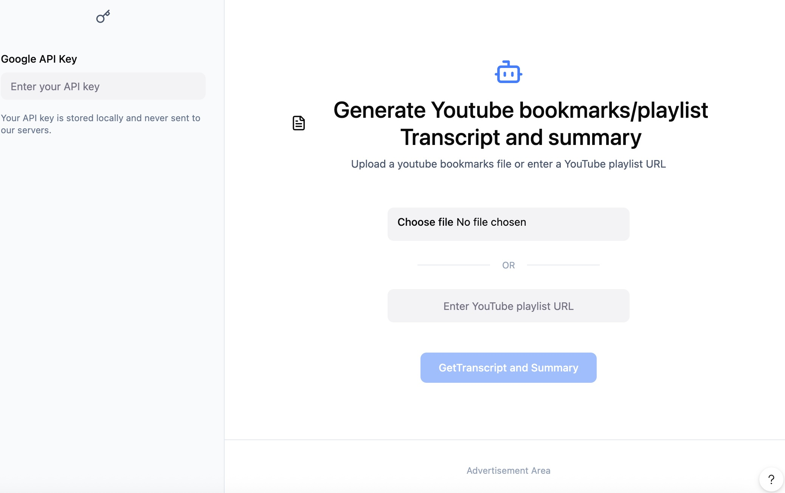

# YouTubeSynth - YouTube Video Transcript Synthesizer

## Project Overview

YouTubeSynth is a Python-based tool for local deployment. It uses a two-agent LLM pipeline to transform collections of YouTube videos into structured knowledge artifacts. The app accepts YouTube video lists in multiple formats (XML, JSON, TXT) or YouTube playlist URLs, fetches transcripts, summarizes each video individually, then synthesizes all summaries into a comprehensive tutorial or article.

## Core Functionality

### Input
- XML file with YouTube video URLs
- JSON file with YouTube video URLs
- TXT file with YouTube video URLs (one URL per line)
- YouTube playlist URL (auto-extracts all video URLs)

### Pipeline

```
Input (file/playlist)
    │
    ▼
[URL Extractor]          ← parser only, no LLM
    │ validated URLs
    ▼
[Agent 1: Transcript Summarizer]   ← per-video, Gemini Flash
    │ per-video summary markdown (one file per video)
    ▼
[Agent 2: Synthesis Agent]         ← all summaries → Gemini Pro
    │ final article/tutorial
    ▼
Output (markdown)
```

### Output
1. **URL Extractor Output** - Validated list of video URLs with video IDs
2. **Agent 1 Output** - Per-video summary files (`summaries/{job_id}/{video_id}.md`)
   - Structured bullet points per video
   - Transcript type flagged (auto-generated vs manual)
   - Token usage recorded
3. **Agent 2 Output** - Synthesized article (`output/{job_id}/result.md`)
   - Coherent narrative combining all videos
   - Thematic organization (not per-video)
   - Deduplicated and cross-referenced content
4. **Token Ledger** - Per-job cost report (`output/{job_id}/token_report.json`)

## Home page UI
<!--
Source - https://stackoverflow.com/a/78391584
Posted by Richard, modified by community. See post 'Timeline' for change history
Retrieved 2026-02-22, License - CC BY-SA 4.0
-->




## Technical Architecture

### URL Extractor (Not an Agent)

**File:** `youtubesynth/extractors/`

Parses input formats and returns validated YouTube URLs. No LLM involved.

- `xml_extractor.py` - Parses XML bookmark exports
- `json_extractor.py` - Parses JSON video lists
- `txt_extractor.py` - Parses plain text (one URL per line)
- `playlist_extractor.py` - Uses `yt-dlp` to extract playlist video URLs
- `url_validator.py` - Validates and normalizes YouTube URLs, extracts video IDs

### Agent 1: Transcript Summarizer

**File:** `youtubesynth/agents/transcript_summarizer.py`

Processes each video independently:
1. Fetch transcript via `youtube_transcript_api` (with retry + backoff)
2. Cache raw transcript to `.cache/transcripts/{video_id}.txt`
3. If transcript > token threshold, chunk it and summarize chunks first, then merge
4. Send to Gemini Flash with summarization prompt
5. Write per-video summary to `summaries/{job_id}/{video_id}.md`
6. Record token usage to SQLite
7. Push SSE progress event

**Model:** Gemini Flash (cheaper, sufficient for per-video reorganization)

**Concurrency:** `asyncio.Semaphore` limits concurrent Gemini calls (configurable, default: 3)

### Agent 2: Synthesis Agent

**File:** `youtubesynth/agents/synthesis_agent.py`

Synthesizes all per-video summaries into one document:
1. Read all `summaries/{job_id}/*.md` files
2. Concatenate into single input (summaries are much smaller than raw transcripts)
3. Send to Gemini Pro with synthesis prompt
4. Write final article to `output/{job_id}/result.md`
5. Record token usage to SQLite
6. Generate token cost report `output/{job_id}/token_report.json`

**Model:** Gemini Pro (higher reasoning for coherent synthesis)

### Chunked Summarization (within Agent 1)

For long videos (transcripts exceeding ~8,000 tokens):
```
long transcript
    │
    ├─ chunk 1 → Gemini Flash → chunk summary 1
    ├─ chunk 2 → Gemini Flash → chunk summary 2
    └─ chunk N → Gemini Flash → chunk summary N
                      │
                      ▼
              merge chunk summaries → Gemini Flash → final video summary
```

Each chunk call is tracked separately in the token ledger.

### Job State — SQLite

**File:** `.data/youtubesynth.db`

```sql
CREATE TABLE jobs (
    id          TEXT PRIMARY KEY,   -- UUID
    status      TEXT,               -- pending | running | done | failed
    style       TEXT,               -- tutorial | article | guide
    title       TEXT,
    total_videos INTEGER,
    done_videos  INTEGER DEFAULT 0,
    created_at  TEXT,
    updated_at  TEXT
);

CREATE TABLE video_progress (
    job_id          TEXT,
    video_id        TEXT,
    title           TEXT,
    url             TEXT,
    status          TEXT,   -- pending | summarizing | done | failed
    transcript_type TEXT,   -- manual | auto-generated | unavailable
    error           TEXT,
    PRIMARY KEY (job_id, video_id)
);

CREATE TABLE token_usage (
    id            INTEGER PRIMARY KEY AUTOINCREMENT,
    job_id        TEXT,
    video_id      TEXT,   -- NULL for Agent 2 (synthesis)
    agent         TEXT,   -- summarizer | synthesis | chunk_summarizer
    model         TEXT,   -- gemini-1.5-flash | gemini-1.5-pro
    input_tokens  INTEGER,
    output_tokens INTEGER,
    cost_usd      REAL,
    created_at    TEXT
);
```

### SSE Progress Events

**Endpoint:** `GET /api/jobs/{job_id}/stream`

Events pushed during processing:
```json
{ "event": "job_started",    "data": { "job_id": "...", "total_videos": 20 } }
{ "event": "video_started",  "data": { "job_id": "...", "video_id": "...", "title": "...", "index": 3, "total": 20 } }
{ "event": "video_done",     "data": { "job_id": "...", "video_id": "...", "transcript_type": "auto-generated", "tokens_used": 1200 } }
{ "event": "video_failed",   "data": { "job_id": "...", "video_id": "...", "error": "No transcript available" } }
{ "event": "synthesis_start","data": { "job_id": "...", "summary_count": 18 } }
{ "event": "job_done",       "data": { "job_id": "...", "output_path": "...", "total_cost_usd": 0.042 } }
{ "event": "job_failed",     "data": { "job_id": "...", "error": "..." } }
```

### Token Cost Tracking

Every Gemini call records:
```python
@dataclass
class TokenRecord:
    job_id: str
    video_id: Optional[str]
    agent: str          # "summarizer" | "synthesis" | "chunk_summarizer"
    model: str          # "gemini-1.5-flash" | "gemini-1.5-pro"
    input_tokens: int
    output_tokens: int
    cost_usd: float     # computed from model pricing table
```

Pricing constants (update as Gemini pricing changes):
```python
PRICING = {
    "gemini-1.5-flash": {"input": 0.075 / 1_000_000, "output": 0.30 / 1_000_000},
    "gemini-1.5-pro":   {"input": 3.50  / 1_000_000, "output": 10.50 / 1_000_000},
}
```

Token report per job (`output/{job_id}/token_report.json`):
```json
{
  "job_id": "...",
  "total_input_tokens": 85000,
  "total_output_tokens": 12000,
  "total_cost_usd": 0.0412,
  "by_agent": {
    "summarizer":      { "input_tokens": 70000, "output_tokens": 9000, "cost_usd": 0.0327 },
    "synthesis":       { "input_tokens": 12000, "output_tokens": 3000, "cost_usd": 0.0073 },
    "chunk_summarizer":{ "input_tokens":  3000, "output_tokens":  200, "cost_usd": 0.0012 }
  },
  "by_video": [
    { "video_id": "abc123", "title": "...", "input_tokens": 4200, "output_tokens": 600, "cost_usd": 0.0005, "transcript_type": "manual" }
  ]
}
```

### Core Components

```
youtubesynth/
├── youtubesynth/
│   ├── __init__.py
│   ├── extractors/               # URL parsing — no LLM
│   │   ├── __init__.py
│   │   ├── xml_extractor.py
│   │   ├── json_extractor.py
│   │   ├── txt_extractor.py
│   │   ├── playlist_extractor.py
│   │   └── url_validator.py
│   ├── agents/
│   │   ├── __init__.py
│   │   ├── base_agent.py
│   │   ├── transcript_summarizer.py   # Agent 1: per-video, Gemini Flash
│   │   └── synthesis_agent.py         # Agent 2: all summaries, Gemini Pro
│   ├── services/
│   │   ├── __init__.py
│   │   ├── gemini_client.py           # API wrapper, rate limiting, retry
│   │   ├── youtube_service.py         # Transcript fetching + caching
│   │   ├── token_tracker.py           # Token ledger + cost computation
│   │   └── db.py                      # SQLite helpers
│   ├── api/
│   │   ├── __init__.py
│   │   ├── routes.py
│   │   ├── sse.py                     # SSE event streaming
│   │   └── schemas.py
│   ├── cli.py                         # CLI entry point (youtubesynth command)
│   └── main.py
├── tests/
│   ├── unit/
│   ├── integration/
│   └── fixtures/
│       ├── sample_videos.xml
│       ├── sample_videos.json
│       ├── sample_videos.txt
│       └── mock_transcripts/
├── examples/
├── .cache/
│   └── transcripts/              # {video_id}.txt — persistent cache
├── summaries/                    # {job_id}/{video_id}.md
├── output/                       # {job_id}/result.md + token_report.json
├── .data/
│   └── youtubesynth.db           # SQLite job state
├── .env.example
├── requirements.txt
└── README.md
```

### Technology Stack

```
youtube-transcript-api>=0.6.0   # transcript fetching
google-generativeai>=0.3.0      # Gemini API
yt-dlp>=2024.0.0                # YouTube playlist extraction
fastapi>=0.109.0                # Web framework
uvicorn>=0.27.0                 # ASGI server (local)
pydantic>=2.0.0                 # Data validation
aiohttp>=3.9.0                  # Async HTTP
aiosqlite>=0.19.0               # Async SQLite
beautifulsoup4>=4.12.0          # XML parsing
python-dotenv>=1.0.0            # Environment variables
sse-starlette>=1.6.0            # SSE support for FastAPI
tiktoken>=0.5.0                 # Token counting pre-flight
```

**Python Version:** 3.10+
**Deployment:** Local — `uvicorn youtubesynth.main:app --reload`

## CLI Interface

### Invocation

```bash
# From a YouTube playlist URL
youtubesynth --playlist "https://www.youtube.com/playlist?list=PLxxx" --style tutorial

# From an XML file
youtubesynth --input videos.xml --style article

# From a JSON file
youtubesynth --input videos.json --style guide

# From a plain text file (one URL per line)
youtubesynth --input videos.txt

# With explicit output directory
youtubesynth --input videos.xml --output-dir ./my-results

# Limit number of videos
youtubesynth --playlist "https://..." --max-videos 20

# Custom output title
youtubesynth --input videos.json --title "My ML Study Guide" --style tutorial
```

### CLI Arguments

| Argument | Short | Description | Default |
|---|---|---|---|
| `--input PATH` | `-i` | Path to XML, JSON, or TXT file with video URLs | — |
| `--playlist URL` | `-p` | YouTube playlist URL | — |
| `--style` | `-s` | Output style: `tutorial`, `article`, `guide` | `article` |
| `--title TEXT` | `-t` | Title for the synthesized output | Auto-generated |
| `--output-dir PATH` | `-o` | Directory to write output files | `./output` |
| `--max-videos N` | | Cap the number of videos to process | 50 |
| `--concurrency N` | | Max concurrent Gemini API calls | 3 |
| `--no-cache` | | Bypass transcript cache, re-fetch all | false |
| `--verbose` | `-v` | Print per-video progress to stdout | false |

> `--input` and `--playlist` are mutually exclusive; exactly one is required.

### Output Files

When the command finishes, all output is written to `--output-dir` (default: `./output/{job_id}/`):

```
output/
└── {job_id}/
    ├── result.md            # synthesized article/tutorial
    └── token_report.json    # per-agent token usage and cost summary
```

Intermediate per-video summaries are written to `summaries/{job_id}/` alongside the output directory and are kept for inspection or re-use.

### Progress Output (stdout)

```
[youtubesynth] Extracting URLs...  12 videos found
[youtubesynth] Summarizing videos (3 concurrent)...
  [ 1/12] ✓ "Intro to Transformers"              (manual transcript, 1,240 tokens)
  [ 2/12] ✓ "Attention is All You Need Walkthrough" (auto-generated, 3,400 tokens)
  [ 3/12] ✗ "Deleted video"                       (no transcript — skipped)
  ...
[youtubesynth] Synthesizing 11 summaries → gemini-1.5-pro...
[youtubesynth] Done.

Output : output/a3f1c2d4/result.md
Report : output/a3f1c2d4/token_report.json
Cost   : $0.042 (85,000 input + 12,000 output tokens)
```

### Entry Point

**File:** `youtubesynth/cli.py`

The CLI is registered as a console script in `pyproject.toml` (or `setup.py`) so `youtubesynth` is available after `pip install -e .`:

```toml
[project.scripts]
youtubesynth = "youtubesynth.cli:main"
```

The CLI reuses the same pipeline as the web API — it calls the same extractor, Agent 1, and Agent 2 code, but drives them synchronously via `asyncio.run()` and prints progress to stdout instead of streaming SSE events. The `--output-dir` flag overrides the `OUTPUT_DIR` env variable for that run only.

## API Endpoints

### Submit Job
```bash
POST /api/jobs
Content-Type: multipart/form-data

{
  "file": <multipart file>,          # XML/JSON/TXT — optional
  "playlist_url": "https://...",     # optional
  "style": "tutorial",               # tutorial | article | guide
  "title": "My Learning Guide",      # optional
  "max_videos": 50                   # guard against huge playlists, default 50
}

Response 202:
{
  "job_id": "uuid",
  "status": "pending",
  "video_count": 12
}
```

### Stream Progress (SSE)
```bash
GET /api/jobs/{job_id}/stream
Accept: text/event-stream
```

### Get Job Status
```bash
GET /api/jobs/{job_id}

Response:
{
  "job_id": "uuid",
  "status": "running",
  "done_videos": 7,
  "total_videos": 12,
  "videos": [
    { "video_id": "abc", "title": "...", "status": "done", "transcript_type": "auto-generated" },
    ...
  ]
}
```

### Get Result
```bash
GET /api/jobs/{job_id}/result

Response:
{
  "job_id": "uuid",
  "content": "# Full article markdown...",
  "token_report": { ... }
}
```

### Download Result
```bash
GET /api/jobs/{job_id}/download        # downloads result.md
GET /api/jobs/{job_id}/token-report    # downloads token_report.json
```

## Prompts

### Agent 1 — Per-Video Summarization Prompt
```python
SUMMARIZE_PROMPT = """
Analyze this YouTube video transcript and reorganize it as structured markdown bullet points.

**Video URL:** {url}
**Video Title:** {title}
**Transcript Type:** {transcript_type}

**Transcript:**
{transcript}

**Task**: Produce a markdown section for this video with:
- A level-2 heading (##) using the video title
- The video URL on the next line
- Hierarchical bullet points covering all key concepts
- Remove filler words, repetition, and off-topic content
- Logical flow from introduction to conclusion
- Note if transcript quality seems poor (auto-generated ASR artifacts)

**Output Format:**
## {title}
URL: {url}

- Main concept 1
  - Sub-point
- Main concept 2
  ...
"""
```

### Agent 2 — Synthesis Prompt
```python
SYNTHESIS_PROMPT = """
You are creating a comprehensive {style} by synthesizing summaries from {num_videos} YouTube videos.

**Per-Video Summaries:**
{summaries_content}

**Task**: Create a cohesive {style} that:
1. Combines complementary information from all sources
2. Removes redundancies while preserving unique insights
3. Organizes content logically by topic (beginner to advanced)
4. Groups related concepts from different videos together
5. Creates smooth transitions between topics
6. Makes no reference to individual videos (seamless synthesis)

**Structure**:
- Engaging introduction
- Sections organized by topic/concept (NOT by video)
- Key takeaways section
- Conclusion and next steps

**Output**: Pure markdown, well-formatted and ready to publish.
"""
```

## Configuration

```bash
# .env.example
GEMINI_API_KEY=your_api_key_here

# Model selection
SUMMARIZER_MODEL=gemini-1.5-flash
SYNTHESIS_MODEL=gemini-1.5-pro

# Concurrency
MAX_CONCURRENT_GEMINI_CALLS=3
YOUTUBE_FETCH_DELAY_SECONDS=1.0   # delay between transcript fetches

# Chunking
CHUNK_TOKEN_THRESHOLD=8000        # chunk transcripts longer than this
CHUNK_SIZE_TOKENS=6000

# Guards
MAX_VIDEOS_PER_JOB=50

# Storage
CACHE_DIR=.cache/transcripts
SUMMARIES_DIR=summaries
OUTPUT_DIR=output
DB_PATH=.data/youtubesynth.db

# Logging
LOG_LEVEL=INFO
```

## Error Handling

- Videos without transcripts: mark as `unavailable`, continue processing others
- Auto-generated transcripts: flag in output, process normally
- Gemini rate limit: exponential backoff with jitter, max 5 retries
- YouTube rate limit: configurable delay between fetches
- Long transcripts: automatic chunking (no manual intervention)
- Job interruption: resume from last completed video using SQLite state + transcript cache
- Max video guard: reject jobs over `MAX_VIDEOS_PER_JOB` with clear error message

## Performance

- Async concurrent processing with `asyncio.Semaphore` for Gemini calls
- Transcript caching prevents redundant YouTube fetches on re-runs
- Per-video summaries are small — Agent 2 context is manageable even for 50 videos
- Progress streamed in real-time via SSE

## Future Enhancements

- [ ] Web UI dashboard (currently API-only)
- [ ] Support for more video platforms (Vimeo, etc.)
- [ ] Export to Notion, Obsidian, PDF
- [ ] Multi-language synthesis
- [ ] Speaker diarization support
- [ ] Video chapter detection and alignment
- [ ] Rate limiting per user/API key (for shared deployment)
- [ ] Email notifications for job completion
- [ ] Duplicate video detection within playlist
- [ ] Custom prompt templates via API
- [ ] Remote deployment option (Railway, Fly.io)
